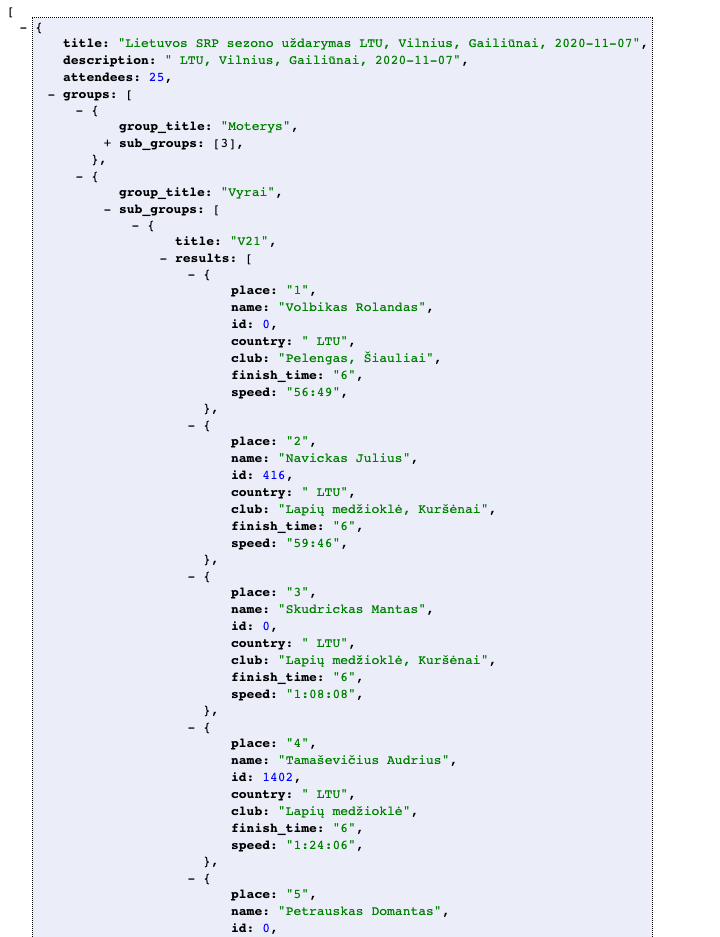

## Web scraper written in Golang.
My first project in golang. [dbsportas](https://dbsportas.lt/lt/varz) web scraper.  

## Motivation
This project mainly comes from a friend request. I searched ideas for my first real world project to make with `Go` and my friend and fellow developer suggested me, to write a web scraper for his personal website of [Orienteering sport](https://oklaipeda.lt). So it was good oportunity to make something with `Go`.

## Overview
There was no particular structure of data to collect, so I decided to make my own interpretation of `JSON` using `Go` `structs`

```go
// Group of competion struct
type Group struct {
	Title     string     `json:"group_title"`
	SubGroups []SubGroup `json:"sub_groups"`
}

// Competition struct
type Competition struct {
	Title       string  `json:"title"`
	Description string  `json:"description"`
	Attendees   int32   `json:"attendees"`
	Groups      []Group `json:"groups"`
}

// AttendeeResult struct
type AttendeeResult struct {
	Place      string `json:"place"`
	Name       string `json:"name"`
	ID         int32  `json:"id"`
	Country    string `json:"country"`
	Club       string `json:"club"`
	FinishTime string `json:"finish_time"`
	Speed      string `json:"speed"`
}

// SubGroup struct
type SubGroup struct {
	Title   string           `json:"title"`
	Results []AttendeeResult `json:"results"`
}

// Result  struct
type Result struct {
	Competitions []Competition `json:"competitions"`
}

```
After running `main.go` file and serving `http` server, you can go to `localhost:8888/scrape/{id}` where `id` is competition `id` E.g `2020154`
and `mux` router will write scraped resource straigt to your browser.  


You basically get:  




## Challenges and some thoughts
- This scraper still has some loose ends. Because structure of the website is generated with some kind of old CMS, `html` elements are mostly without `class` attributes, so to select something, you need some guessing if that item even exists.
- Structure of `JSON` can be modified for more specific use cases, for me it was just some nested objects for nested scraping challenge.
- Maybe later I could try add some `go routines` for concurrent request to the website.
- Error handling could be improved.
